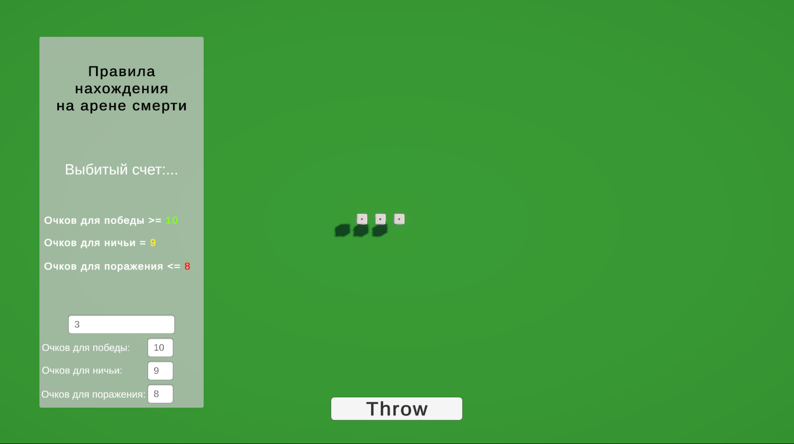
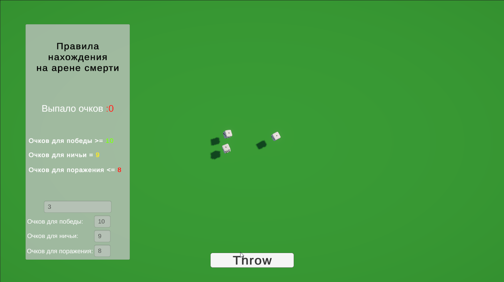
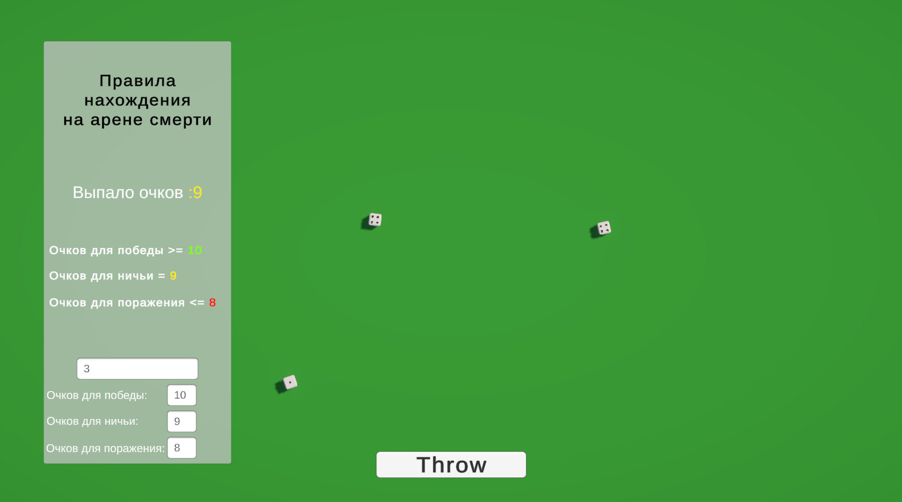

# The Dice Homework

## Описание

Домашнее задание по курсу «Продвинутая разработка игр» от TargemGames и Sliva.

**MonoBehHomework** — это простая игра в кости, реализованная на движке **Unity 6**. Игрок может подкидывать кости, после чего подсчитывается сумма выпавших очков.

## Скриншот

*Скриншот игрового процесса: бросок костей и отображение 
суммы очков.*
